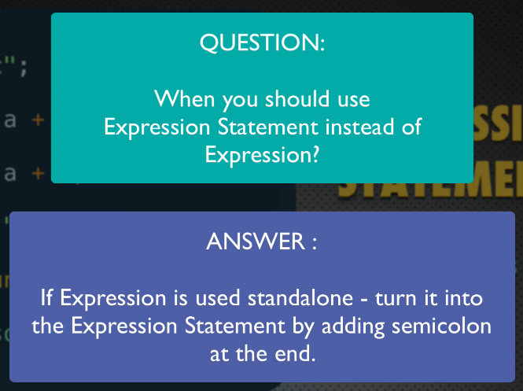

# Diferença entre expressões e statements

Tradução de statement: *declaração*.

- [Diferença entre expressões e statements](#diferença-entre-expressões-e-statements)
  - [Conceito de expressão](#conceito-de-expressão)
    - [Caso especial](#caso-especial)
    - [Expressões com efeitos colaterais](#expressões-com-efeitos-colaterais)
  - [Statements (declarações)](#statements-declarações)
  - [Expression Statements](#expression-statements)
    - [Quando usar ";"?](#quando-usar-)
  - [Como distinguir os dois?](#como-distinguir-os-dois)

## Conceito de expressão

Quando a linha retorna um valor.

```js
console.log("blablabla");
// ^-- expressão que retorna "undefined".

"abc"
// abc

a + b
// soma de a + b

a <= b || c !== d
// true ou false

minhaFuncao(c, d)
// retorno de minhaFuncao (undefined se não houver retorno)
```

> Expressões **NÃO** requerem **";"** no fim da linha!

### Caso especial

*Assignment Expression*

```js
a = 10;
// 10
```

LValue e RValue (de left e right).

LValue: expressão que se refere a uma localização em memória.
**Geralmente**, é uma `variável` ou uma `propriedade/campo` de um objeto (com uso de *dot-notation*)

### Expressões com efeitos colaterais

Quando, além de um retornarem algo, performam uma(ou várias) ação.

Exemplos:

```js
a = 5;
b++;
minhaFuncao(c, d);
```

[Topo](#diferença-entre-expressões-e-statements)

---

## Statements (declarações)

Produzem uma **ação**, não um valor, **ação**.

>Statements **GERALMENTE** (se não forem blocos[if, for, etc]) terminam com **";"**!

```js
let a;
// statement

const b = 5;
// expressão contida numa statement
// ^-- nesse caso, usar ";"

if (a > b) {
//☝ if statement
  console.log("A é maior!");
  // ^-- expressão
}

for (let i = 0; i++; i < 5) {
  // ^-- statement
  console.log(i);
  // ^-- expressão
}
```

[Topo](#diferença-entre-expressões-e-statements)

---

## Expression Statements

Por que usamos **";"** num `console.log()`?

> *Expressão* pode ser transformada numa *Statement*. Chamadas de **Expressions Statements**.

```js
"abc";
// "expression statement"

a = a + 3;
c = a + b;
d = "Good " + "Evening";

minhaFuncao(c, d);
/* expressão transformada em "expression statement"
pelo uso de ";" */

console.log("Hey");
// ^-- mesma coisa
```

Statements não podem ser tornadas em expressions. Não é possível tornar em expressions:

- if
- for-loop
- declaração de variável

### Quando usar ";"?



- `console.log("oi")`
  - expression
- `console.log("oi");`
  - expression statement

Usar **;** sempre que possível por questões de legibilidade.

[Topo](#diferença-entre-expressões-e-statements)

---

## Como distinguir os dois?

1. Expressões podem ser usadas como argumentos em chamadas de função.

```js
function minhaFuncao(a) {
                  // ^-- expression
  console.log(a);
  // ^-- expression statement
}

let b = true;
let c = 10;

minhaFuncao(2 + 3); // 5
         // ☝ expression
// ☝ expression statement

minhaFuncao(b); // true
minhaFuncao(c = c + 1); // 11
minhaFuncao(c = c + 1;);
              // ☝ erro de sintaxe
              /* statement não pode ser passado
              como argumento! */
minhaFuncao(let d);
            // ☝ tb
```

O engine do JavaScript contém duas fases:
- compilação
- execução

Ao tentar executar o código contendo `minhaFuncao(c = c + 1;);` ou `minhaFuncao(let d);`, o código **não será** executado!

[Topo](#diferença-entre-expressões-e-statements)
