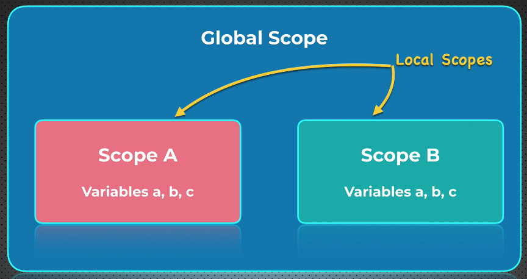
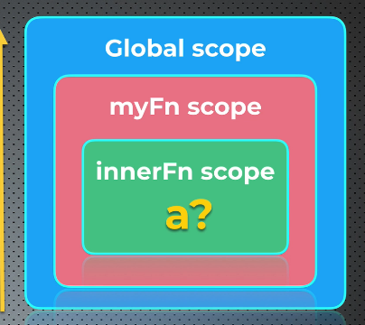

# Escopos em JS

- [Escopos em JS](#escopos-em-js)
  - [Scope chain](#scope-chain)
  - [Funções puras e impuras](#funções-puras-e-impuras)
    - [Puras](#puras)
    - [Impura](#impura)
  - [Variáveis não declaradas e Strict Mode](#variáveis-não-declaradas-e-strict-mode)
    - [Strict Mode](#strict-mode)
      - [Outras restrições do Strict mode](#outras-restrições-do-strict-mode)


3 tipos de escopos

- global
- função
- bloco

Nada de novo: *alcance/disponibilidade* de variáveis.


Variáveis declaradas na *raiz* do arquivo js: global

> local scope e function scope (sinônimos)!

```js
let a;
let b;
// ^-- global

function minhaFuncao() {

  let b; // local
  a = true; // global
  b = 10;
  console.log(b); // 10
}

minhaFuncao();

console.log(a); // true
console.log(b); // undefined
```

>☝ A variável b global não pode mais ser referenciada dentro de `minhaFuncao`

[Topo](#escopos-em-js)

---

## Scope chain

Procurar variáveis partindo do escopo atual e *subindo* até encontrar (se ela existir). Ou seja: escopo global tem a precedência mais baixa na scope chain.

```js
const a = 5; // global

function minhaFuncao() { // global
  function funcaoInterna() { // local scope
    console.log(a); // 5
  }
  funcaoInterna(); // chamada no escopo local
}

minhaFuncao();
```
☝ A variável *"a"* será encontrada percorrendo a *scope chain*.



[Topo](#escopos-em-js)

---


## Funções puras e impuras

### Puras

Quando a função altera apenas variáveis de escopo local ou parâmetros da função.

### Impura

Inverso de pura. Os exemplos acima são *funções impuras*.

> Funções "impuras" são uma **PÉSSIMA** prática!

[Topo](#escopos-em-js)

---


## Variáveis não declaradas e Strict Mode

```js
function minhaFuncao(){
  a = true;
  // ☝ a não declarada. Válido!
  console.log(a) // true
}

minhaFuncao();

console.log(a); // true
```

A variável *a*, segundo o *scope chain*:
- Não foi declarada na função
- Não foi declarada globalmente
- Se não existe **NEM** globalmente, é declarada globalmente de forma **implícita**.

>Declarar variáveis desse jeito é uma **péssima** prática!

### Strict Mode

Modo de operação do *JavaScript engine*. Previne o uso de variáveis **não declaradas**. Introduzido no Ecma Script 5(2009). Previne erros humanos de nomes de variáveis escritos errados de forma errada.

Ativando o strict mode: `"use strict";`. É uma string! Mesma regra para outras strings: double ou single quotes.

O fato de ter ";" no final faz com que browsers sem suporte ao ECMA Script 5 ignorem essa linha. Usar ";" torna a expressão em *expression statement*.

>Pode ser usado em escopo de função, mas é recomendado usar **SEMPRE** no início do escopo global.

```js
"use strict";

function minhaFuncao() {
  a = true;
  // Uncaught ReferenceError: a is not defined at minhaFuncao
  console.log(a);
}
```

#### Outras restrições do Strict mode

- Não poder deletar variáveis usando o operador "delete".

foi a única que ele citou, até agora. Isso será visto de novo.

[Topo](#escopos-em-js)

---
