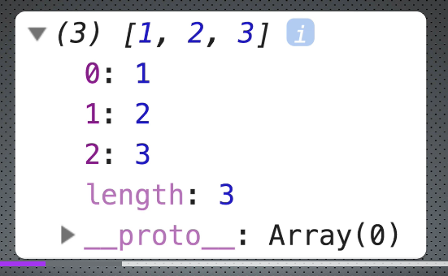

# Arrays

- [Arrays](#arrays)
  - [Sintaxe de um Array](#sintaxe-de-um-array)
  - [Estrutura de um array](#estrutura-de-um-array)
  - [Alterar, inserir, deletar valores num Array](#alterar-inserir-deletar-valores-num-array)
  - [Métodos de um array](#métodos-de-um-array)
  - [Modificar elementos](#modificar-elementos)

Relembrar da ideia de que, quase, tudo em JS é um Objeto.

índices são como as varíaveis: tipagem dinâmica.

Conceito:

Objeto com nomes de propriedades numéricos (ao invés de strings).

## Sintaxe de um Array

```js
// notação "array literal" (mais usada)
const meuArray1 = [1, 2, 3];
console.log(meuArray); // [1, 2, 3]

// criando com "new" keyword
const meuArray2 = new Array(1, 2, 3);
console.log(meuArray); // [1, 2, 3]
```

O que retorna `meuArray1 === meuArray2`?

Resposta: false!
Array é uma variável do tipo referência. meuArray1 e meuArray2 são objetos diferentes. A comparação seria algo parecido com o `.equals` do *Java*.

[Topo](#arrays)

---

## Estrutura de um array



Diferença da estrutura de um objeto tradicional:

- propriedade lenght **dinâmica**
- `prototype` *Array* ao invés de *Object*
- métodos específicos de Arrays

[Topo](#arrays)

---

## Alterar, inserir, deletar valores num Array

```js
const meuArray = [1, 2, 3, 4];
console.log(meuArray); // [1, 2, 3, 4]

// alterando um índice
meuArray[2] = "abc"
console.log(meuArray); // [1, 2, "abc", 4]

// adicionando um índice
meuArray[4] = true;
console.log(meuArray); // [1, 2, "abc", 4, true]
```

[Topo](#arrays)

---

## Métodos de um array

funções que são propriedades do `Array prototype`

- push
  - adicionar no fim
- pop
  - remover do fim
- shift
  - remover do início
- unshift
  - adicionar no início

> Lembrar que um array é um OBJETO e objetos são **mutáveis** e **tipo referência**. É possível adicionar e remover índices mesmo de um array *const*.

## Modificar elementos

```js
const meuArray = [3, true, "abc", {}];

// adicionando uma propriedade ao objeto no índice 3
meuArray[3].novaPropriedade = 10;
meuArray[3]["novaPropriedade"] = 10;

console.log(meuArray[3].novaPropriedade);
console.log(meuArray[3]["novaPropriedade"]);
//! equivalentes
```
