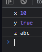
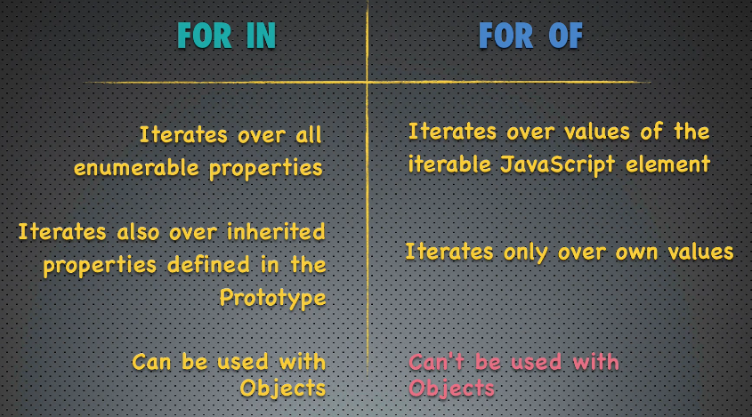

# Loops em JS

- [Loops em JS](#loops-em-js)
  - [For loop](#for-loop)
  - [While loop](#while-loop)
  - [Do ... While loop](#do--while-loop)
  - [For in \& For of](#for-in--for-of)
    - [For In](#for-in)
    - [For Of](#for-of)
    - [Diferença entre os dois](#diferença-entre-os-dois)


Apenas o que for novidade.

Ainda no básico de JS, talvez hajam outros *loops* depois.

Os loops são **STATEMENTS**. Prova: passar um loop como parâmetro de função.

**Não** é recomendado usar *loops* para iterar sobre Arrays. Preferir os
*helper methods* do Array prototype que vêm por herança.

loops citados

- `for`
- `while`
- `do ... while`
- `for ... of ...`
  - novidade!
- `for ... in ...`
  - novidade!

## For loop

Nada de novo. Um for loop que imprime de 0 a 4:

```js
for (let i = 0; i < 5; i++) {
  console.log(i);
}
```

[Topo](#loops-em-js)

---

## While loop

Igual a C e Java

```js
let i = 0;
// ^-- i já precisa existir

while (i < meuArray.length) {
	console.log(meuArray[i]);
	i++;
	// última ação por iteração no foor loop
}
```

---

## Do ... While loop

Igual a C e Java

```js
let x = 0;

do {
	console.log(meuArray[x]);
	x++;
} while (x < meuArray.length);
```

[Topo](#loops-em-js)

---

## For in & For of

Novidade (eu acho)

me parece o `for each`

### For In

Opção recomendada para iterar sobre objetos

```js
// Uso com Objetos
const meuObjeto = {
	x: 10,
	y: true,
	z: "abc"
}

for (let propriedade in meuObjeto) {

	console.log(propriedade, meuObjeto[propriedade]);
}
// --------------------
// Uso com Arrays
const meuArray = [true, 10, "abc", null];

for (let chave in meuArray) {
  console.log(meuArray[chave]);
}
```



[Topo](#loops-em-js)

### For Of

Mais novo (ES6)

```js
for (Elemento of Iterable) {
  ...
  ...
  ...
}
```

Definição de `Iterable`:

qualquer variável que possui Iterator *builtin* ou customizado. Todo Array possui um Iterable *builtin*. Exemplo de `Iterable` *values*: arrays e strings.

>**Não funciona** *out of the box* com objetos! É preciso definir um Iterator **customizado**!

Se não funciona com objetos, objetos não são `Iterable`.

```js
const meuArray = [true, 10, "abc", null];

for (let elemento of meuArray) {
	console.log(elemento);
}
```

### Diferença entre os dois



Propriedades enumeráveis:
Propriedades de tipo **primitivo**. Não funciona com *métodos* (funções como propriedade).

---
