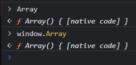
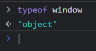

# Objetos / funções Array e String

- [Objetos / funções Array e String](#objetos--funções-array-e-string)
  - [Instanciando um Array](#instanciando-um-array)
    - [Comparando Arrays](#comparando-arrays)
  - [Instanciando uma string](#instanciando-uma-string)
    - [Typeof](#typeof)
    - [Instance Of](#instance-of)
    - [Usando um método de um Objeto String](#usando-um-método-de-um-objeto-string)
      - [**IMPORTANTE**](#importante)

Objetos, variáveis, funções. São tudo isso!
Chamadas, também, de funções construtoras.

Objetos / funções construtoras / propriedades de *window*/*global*:

- Array
- Boolean
- Number
- String

Se são funções como atributo 👉 métodos.



Se o escopo é global, estão no objeto *window*. No *Nodejs*, o objeto *global* é o equivalente ao *window*.



## Instanciando um Array

Já é feito na sintaxe normal. É equivalente a essa sintaxe:

```js
const meuArray = [];
const meuArray2 = new Array();
// Equivalentes
```

### Comparando Arrays

Lembrar que Arrays são do tipo referência (objetos). Armazenam ponteiro para o Array/Objeto. Objetos diferentes não são iguais (apenas o conteúdo pode ser igual).

```js
const meuArray3 = [1, 2, 3];
const meuArray4 = new Array(1, 2, 3);

if (meuArray3 === meuArray4) {
    console.log("Iguais");
} else {
    console.log("Diferentes");
} // diferentes
// Objetos diferentes

if (meuArray3.values === meuArray4.values) {
  console.log("Iguais");
} else {
  console.log("Diferentes");
} // iguais
  // apenas o conteúdo pode ser igual!
```

[Topo](#objetos--funções-array-e-string)

---

## Instanciando uma string

Sintaxes ***NÃO*** equivalentes! Tipo primitivo e objeto. Lembrar das *Wrapper Classes* do Java!

```js
const minhaString1 = "abc";
const minhaString2 = new String("abc");
// DIFERENTES! primitivo e objeto
```

### Typeof

```js
typeof minhaString1; // string
typeof minhaString2; // object
```


*minhaString2* é um objeto!

### Instance Of

```js
minhaString1 instanceof String; // false
minhaString2 instanceof String; // true
minhaString2 instanceof Object; // true
// ^-- prototype chain
```

Objeto string: *prototype chain*
- Prototype String
- Prototype Object

### Usando um método de um Objeto String

de novo: lembrar de *wrappers* no *Java*

```js
// instanciando
const minhaString = new String("String qualquer");

// chamando o método
minhaString.toUpperCase();
```

#### **IMPORTANTE**

String não é um objeto e a chamada de método ***FUNCIONA***!

```js
minhaString = "Não sou objeto!";
minhaString.toUpperCase(); // NÃO SOU OBJETO!
```

> `minhaString` continua sendo primitivo. Foi tratado como objeto apenas na chamada de função. É **por isso** que é costume declarar as variáveis como primitivas / sintaxe literal.

[Topo](#objetos--funções-array-e-string)
