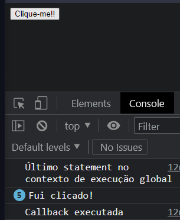

# Callbacks e o Contexto de Execução

- [Callbacks e o Contexto de Execução](#callbacks-e-o-contexto-de-execução)
	- [Recap do contexto de execução](#recap-do-contexto-de-execução)
	- [Callback Functions](#callback-functions)
	- [Desafio](#desafio)
		- [O que aconteceu](#o-que-aconteceu)
	- [Ordem da fila de eventos](#ordem-da-fila-de-eventos)
	- [Exemplo de uso da Web API](#exemplo-de-uso-da-web-api)

Funções callback, eventos, fila de eventos e contextos de execução.

## Recap do contexto de execução

A função a seguir **para** a execução de tudo enquanto ela não terminar:
```js
function funcaoEspera(tempoEmMs) {
	const tempoFuturo = Date.now() + tempoEmMs;

	while (tempoFuturo > Date.now()) {
		// esperando...
	}
}

funcaoEspera(5000);
```
Por quê? No *contexto de execução global*, é aberto um *contexto de execução de função*. Enquanto a pilha do contexto de execução de função não fechar, o programa fica *preso*.

## Callback Functions

O comportamento é **diferente** para *callback functions* como parâmetros.

>**Callback Functions**: funções usadas como parâmetro de outra função.

A última *statement* **sempre** é executada primeiro! Não importa o tempo em *ms* de *setTimeout*.

```js
setTimeout(() =>
  console.log("Callback executada"), 2000
);

console.log("Último statement no contexto de execução global");

// saída:
// Último statement no contexto de execução global
// Callback executada
```
Por que isso acontece?

A *callback function* (e o valor em *ms*) é posta num local separado de memória(chamado de *Web API*). Após estar na Web API, o *contexto de execução da função* mais externa é fechado e a execução volta para o *contexto de execução global*.

Quando o *contexto de execução global* estiver **vazio**(depois do último log), o que está na *Web API* entra em cena. Após os dois segundos, a *callback function* é posta na *fila de eventos* e a função é executada!

## Desafio

Alterar a ordem de `funcaoEspera(5000)` e `setTimeout`. Explicar o que aconteceu.

```js
function funcaoEspera(tempoEmMs) {
	const tempoFuturo = Date.now() + tempoEmMs;

	while (tempoFuturo > Date.now()) {
		// ... esperando ...
	}
}

// invertidos
setTimeout(() => console.log("Callback executada"), 2000);
funcaoEspera(5000);

console.log("Último statement no contexto de execução global");
```

### O que aconteceu

1. invocação do "setTimeout"
   1. o log e o tempo são postos no "Web API"
   2. quando entram na "Web API" os dois segundos já estão contando.
2. invocação da "funcaoEspera"
   1. a execução de TUDO para por 5 segundos.
   2. os dois segundos da callback já terão passado.
3. Último statement é executado.
4. Fila de eventos é executada.

[Topo](#callbacks-e-o-contexto-de-execução)

---

## Ordem da fila de eventos

Usando o desafio acima e adicionando cliques no botão. A *fila de eventos* agora está com cliques e a *callback function*.



Mesmo após 2 segundos, os cliques são considerados primeiro. A *fila de eventos* priorizou os cliques por uma questão de **UX**(*user experience*).

## Exemplo de uso da Web API

Pedir a previsão do tempo de um servidor remoto. O *browser* espera a resposta na área da *Web API*. Quando a resposta vier, o evento será posto na *fila de eventos*.
