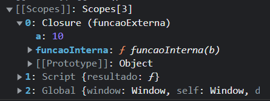

# Closures

Funcionalidade especial do JS. Closure é criada quando uma função retorna *outra* função. Uma varíavel que teve o retorno atribuído pode chamar essa função. A função terá acesso ao escopo da função interna.

Isso vai ser **revisto** em aulas futuras.

Ao fazermos um `dir` na `funcaoInterna`:

