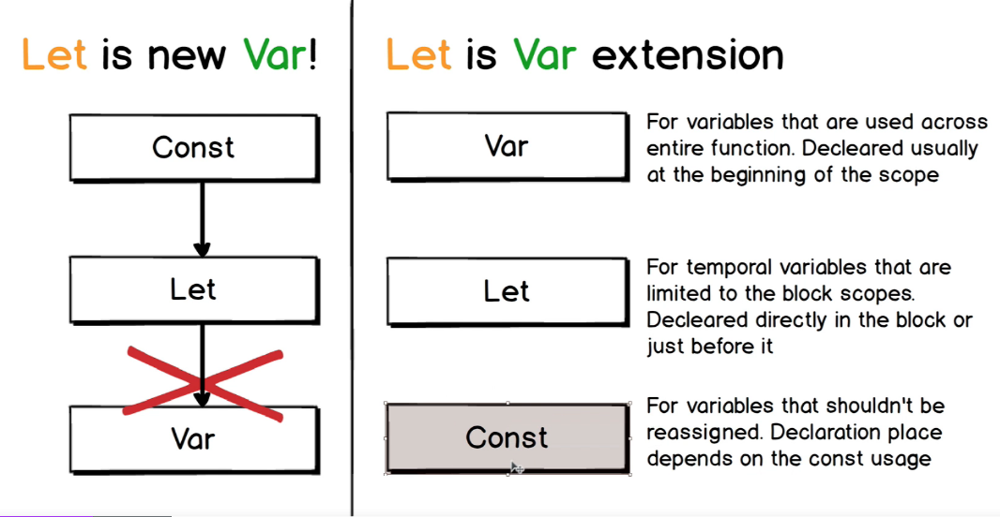

# Variáveis ES6

- [Variáveis ES6](#variáveis-es6)
  - [VAR: Recap de alguns conceitos](#var-recap-de-alguns-conceitos)
    - [Escopo](#escopo)
    - [Redeclaração](#redeclaração)
    - [Hoisting (içamento / levantamento)](#hoisting-içamento--levantamento)
    - [Hoisting é feito apenas em DECLARAÇÕES](#hoisting-é-feito-apenas-em-declarações)
  - [LET](#let)
    - [Escopo](#escopo-1)
    - [Redeclaração](#redeclaração-1)
    - [Hoisting (içamento / levantamento)](#hoisting-içamento--levantamento-1)
  - [Diferenças entre Var e Let](#diferenças-entre-var-e-let)
    - [Escopo](#escopo-2)
    - [Redeclaração](#redeclaração-2)
    - [Hosting](#hosting)
  - [Const](#const)
    - [Semelhanças Const e Let](#semelhanças-const-e-let)
  - [Quando usar var, let e const](#quando-usar-var-let-e-const)

Em JS, existem 3 maneiras de declarar uma variável

- var
- let
- const

## VAR: Recap de alguns conceitos

### Escopo

Tipos de escopo:

- global
- função
- bloco

**Bloco**: variáveis declaradas entre bloco de chaves `{...}`. `Bloco` inclui *loop* e *statements condicionais*.

>Usando `var`, variáveis num bloco são **globais**!

```js
{
  var c = 10;
  // ^-- global
}
```

```js
if (true) {
  // escopo de bloco
} else {
  // escopo de bloco
}
```

```js
var a = 10; // escopo global
//* Disponível como propriedade de "window".

console.log(a);
console.log(this.a);
console.log(window.a);
console.log(global.a); // Nodejs

function funcao() {
	var b = true;
  // escopo APENAS da função!
	console.log(b);
}

funcao();

console.log(b);
// "b" não está definido!
```

### Redeclaração

Usando `var`, é possível *redeclarar* uma variável.

```js
var d = false;
var d = true;

// CUIDADO: dentro de uma função:
function funcao() {
	var d = 5;
	// escopo de "d" é APENAS da função!

	console.log("\"d\" interno: " + d); // 5
	console.log("\"d\" externo: " + window.d); // true
}

funcao();
```

[Topo](#variáveis-es6)

### Hoisting (içamento / levantamento)

Usar uma variável sem declará-la. Ela será declarada de forma automática. *Hoisting* declara uma variável no topo do escopo atual!

>Apenas as **declarações** sofrem *Hoisting*. Inicializações permanecem no mesmo lugar.

>*Hoisting is JavaScript's default behavior of moving all declarations to the top of the current scope (to the top of the current script or the current function).*
>
>w3schools

Antes da execução do código, o JS procura por declarações de variáveis e as põe no início do código.

Esse comportamento **não** acontece com o uso do **Strict Mode**!

```js
// var e;
// ^-- declaração implícita pelo JS

// "e" sem declaração
e = 5;
```

### Hoisting é feito apenas em DECLARAÇÕES

```js
var x = 5; // Inicializando x
var y = 7; // Inicializando y

console.log(x + y); // 12
```

O código abaixo (depois do hoisting)

```js
var x = 5; // Inicializando x

console.log(x + y); // NaN

var y = 7; // Inicializando y
```

fica assim:
```js
var x = 5; // Inicializando x
var y;
console.log(x + y); // NaN

y = 7; // Inicializando y
```


[Topo](#variáveis-es6)

---

## LET

### Escopo

Existem apenas em seus respectivos escopos:

```js
{
	let b1 = 1;
}

for(let j = 0; j < 5; j++) {
	console.log(j);
}
```

>Ao trocar *let* por *var*, **b1** e **j** se tornam **globais**!

### Redeclaração

Redeclarar com `let` causa erro.

```js
let d = false;
// let d = true; // Erro: Identifier 'd' has already been declared

function funcao() {
	let d = 5;
	// escopo de "d" é APENAS da função!

	console.log("\"d\" interno: " + d); // 5
	console.log("\"d\" externo: " + window.d); // undefined
}
```

### Hoisting (içamento / levantamento)

Causa erro.

```js
e = 5;
let e;
// Uncaught ReferenceError: Cannot access 'e' before initialization
```

```js
function funcao4() {
	console.log(f);
	let f;

	f = 10;
}
funcao4();
// Uncaught ReferenceError: Cannot access 'f' before initialization
```

[Topo](#variáveis-es6)

---

## Diferenças entre Var e Let

### Escopo

Iguais no escopo global e de função. **Diferentes** no escopo de bloco.

### Redeclaração

Não é possível redeclarar let (no mesmo escopo).

### Hosting

Causa erro com let.

[Topo](#variáveis-es6)

---

## Const

O que é *const*?

Não possui o mesmo significado da matemática.

- Variável que não pode sofrer **REATRIBUIÇÃO**.
- **Exige** atribuição na declaração.

O valor ***PODE*** mudar quando a variável é do tipo referência.

>Usar CAPITAL_LETTERS apenas para valores *True Constant*. Exemplo: **PI**.

Tudo aqui é válido:
```js
const minhaConstante = [];

minhaConstante.push("novoElemento");
minhaConstante.push("outroElemento");

const outraConstante = {};
console.log(outraConstante);

outraConstante.a = 10;
console.log(outraConstante);

outraConstante.b = 30;
console.log(outraConstante);
```

### Semelhanças Const e Let

Tirando reatribuição, *const* é igual a *let*.

[Topo](#variáveis-es6)

---

## Quando usar var, let e const

Usar a interpretação do segundo grupo. Convenção semântica.



`const`

`var`

- Variáveis que podem mudar em todo o escopo no qual foram declaradas.

`let`

- Escopos Restritos
  - Loops
  - if / else
