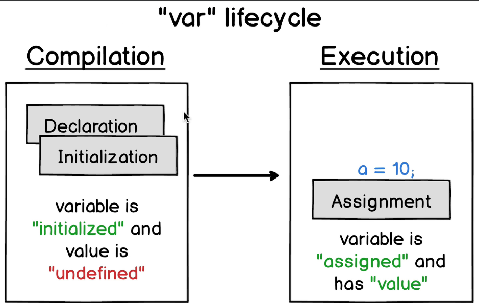
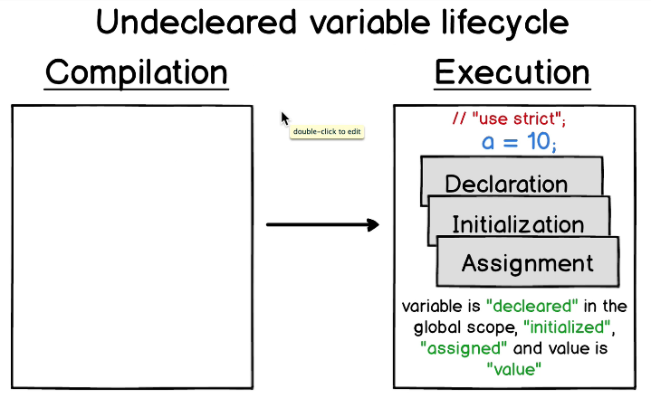
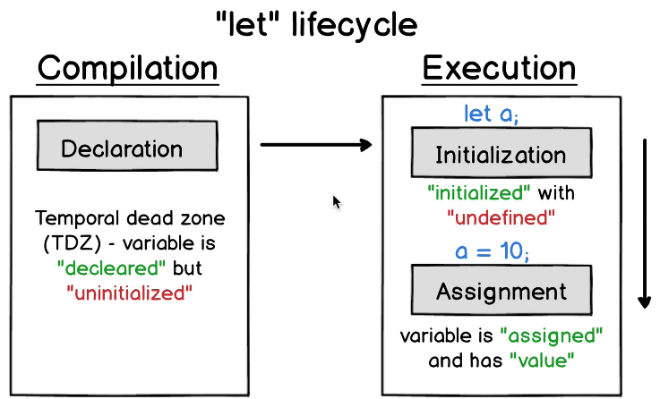
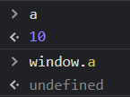

# Fases do Engine JS e variáveis

- [Fases do Engine JS e variáveis](#fases-do-engine-js-e-variáveis)
  - [Fases do JS Engine](#fases-do-js-engine)
    - [Compilação](#compilação)
    - [Execução](#execução)
  - [Fases das variáveis](#fases-das-variáveis)
    - [Ciclo de vida de VAR](#ciclo-de-vida-de-var)
    - [Variáveis sem declaração](#variáveis-sem-declaração)
    - [Ciclo de vida de LET](#ciclo-de-vida-de-let)
      - [Let Compilation phase](#let-compilation-phase)
      - [Let Execution phase](#let-execution-phase)
      - [Mais uma diferença com VAR](#mais-uma-diferença-com-var)


## Fases do JS Engine

Existem **duas** fases no *JS Engine*.

O código é executado em duas fases. *Compilação* e *Execução*.

### Compilação

Acontece antes da execução. Todo o código é visto. Todas as variáveis e escopos são definidos.

É criado um **Objeto de Ativação** contendo todas as variáveis

### Execução

Execução por ordem de escrita(cuidado com a *event queue*)

[Topo](#fases-do-engine-js-e-variáveis)

---

## Fases das variáveis

Não são as fases em código! É feita internamente pelo *JS Engine*

**Declaração**

 Registro da variável no seu respectivo **escopo**.

**Inicialização**

Alocação em memória para a variável. Declaração com *var* pega *undefined* automático.

**Atribuição**

Nessa fase, valores são atribuídos às variáveis.

### Ciclo de vida de VAR



Declaração e inicialização acontecem na etapa **Compilation Phase** do JS Engine. Antes da execução. É por isso que a ordem da declaração(no código) com var não importa.

Lembrar de *Hoisting*.

>var é inicializada com o valor *undefined* na *compilation phase.* Esse comportamento é diferente de **let** e **const**

```js
a = 10;
var a;
// compilation phase declara e inicializa "a".
// execution phase atribui o valor 10 (quando chega na linha).
```

[Topo](#fases-do-engine-js-e-variáveis)

---

### Variáveis sem declaração



- O ciclo de vida é **todo** na fase de execução.
- O escopo será global (mesmo no escopo de uma função).

```js
function fn() {
  function fn2() {
    console.log(a); // a is not defined
    a = 10;
  }
  fn2();
}
fn();
```

- Nesse caso, a ordem da atribuição importa! Importa porque não houve declaração na *compilation phase*. A variável será lida e criada na execution phase.

É possível usar a diretiva **"strict mode"** para impedir a criação de variáveis dessa forma.

[Topo](#fases-das-variáveis)

---

### Ciclo de vida de LET



#### Let Compilation phase

1. Encontrada variável com let
2. Variável declarada com seu escopo
3. ☝ declarada, mas não **inicializada**

>**Não inicializada** significa que haverá erro se for tentado acessar a variável antes da *statement* let.

O período entre a fase de compilação e a declaração(em código) pelo let é chamado de *TDZ* (Temporal Dead Zone)

#### Let Execution phase

A variável é inicializada **apenas** na linha com o *let*. O código anterior está dentro da *TDZ*. Inicializada com *undefined*

#### Mais uma diferença com VAR

É possível acessar o valor de **a** assim:

```js
let a;
a = 10;

console.log(a); // 10
```

Mas não assim:

```js
console.log(window.a); // undefined
```



let não torna "a" como propriedade do objeto global *window*!

[Topo](#fases-do-engine-js-e-variáveis)
