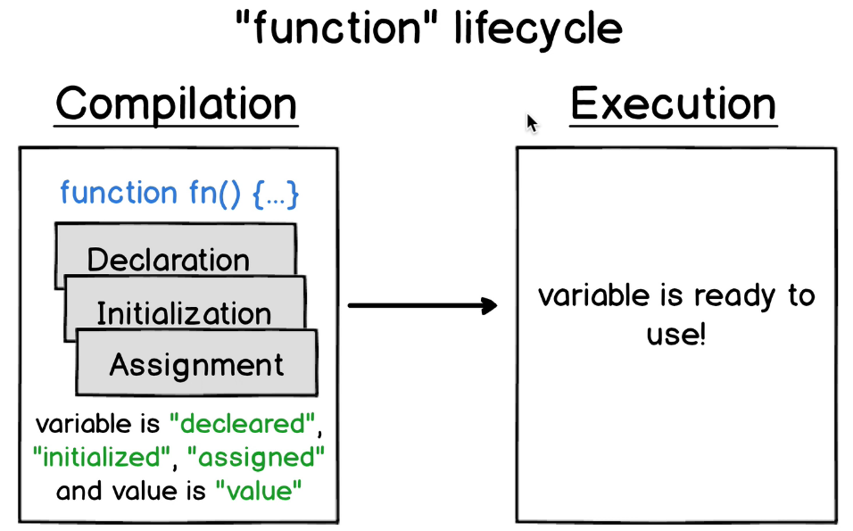

# Lifecycle de funções



Funções são variáveis e estão sujeitas às mesmas fases de *var*, *let* e *const*.

Como as 3 etapas acontecem na *compilation phase*, a função pode ser chamada em qualquer lugar. Chamada, inclusive, antes da declaração.

Esse código é **válido**!
```js
minhaFuncao();

function minhaFuncao() {
  console.log("teste");
}
```

Ver o conteúdo da função/variável minhaFuncao:

```js
console.log(minhaFuncao);
```

## Function expressions

Não estão sujeitas às fases que acontecem nas *function declarations*.

### IIFEs

Apenas é executada, sem passar pelas etapas.
```js
// IIFE
(function() {
  console.log("Teste")
})();
```

### Atribuição de Function Expression

ao atribuir para *const* ou *let*. As respectivas fases de *const* e *let* se aplicam. Como uma atribuição qualquer para *const* e *let*.

Com *var*, a variável é inicializada na *compilation phase* com *undefined*. O valor será *undefined* até a fase de atribuição.

```js
const soma = function(a, b) {
  return a + b;
}
```
