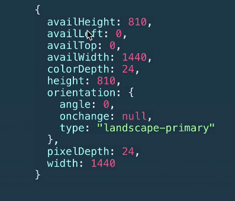
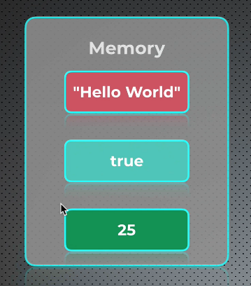
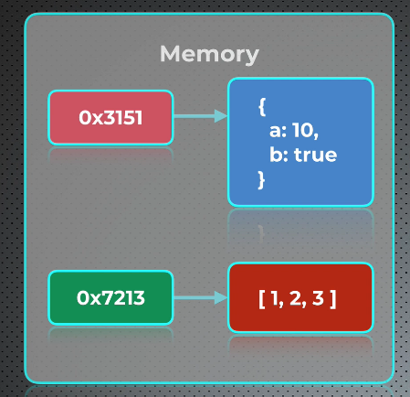
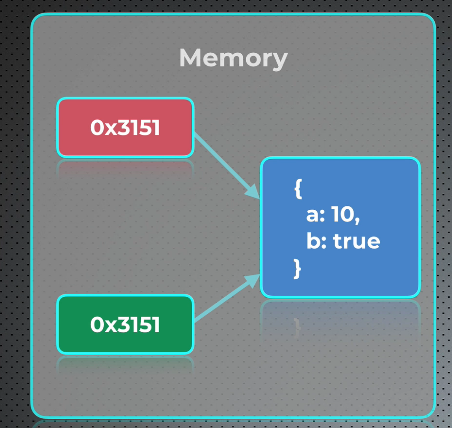

# Tipos e variáveis

- [Tipos e variáveis](#tipos-e-variáveis)
  - [O que é um objeto?](#o-que-é-um-objeto)
  - [Diferenças entre tipos primitivos e referência](#diferenças-entre-tipos-primitivos-e-referência)
    - [Tipos de variáveis primitivas](#tipos-de-variáveis-primitivas)
    - [Tipo Referência](#tipo-referência)

O coceito mais importante em JavaScript

> Quase tudo em JavaScript é um OBJETO

## O que é um objeto?

Objeto em JavaScript: coleção de pares *nome-valor*.

Onde nome é uma *string* e valor pode ser *string*, *number*, *boolean* ou **outro** objeto.

Como um objeto JS se parece?

É um objeto:

- Função
- Array
- Booleano
- Expressão regular
- número\*
- String\*

\* Se comporta como um objeto.

>☝ **NÃO** são tipos primitivos!

Existem dois tipos de variáveis: *primitivas* e *refêrencia*. Isso apenas tem a ver com a maneira com as entidades são armazenadas em memória.

> Há apenas um tipo de referência em JS: Object

[Topo](#tipos-e-variáveis)

---

## Diferenças entre tipos primitivos e referência

**Todos** os tipos de variáveis em JS pertencem a um dos dois grupos: tipo *primitivo* e tipo *referência*.

Os dois tipos são armazenados em memória de uma maneira diferente.

### Tipos de variáveis primitivas

- String
- Boolean
- Number
  - ints e floats
- Null
  - apenas null, *nada* além de null
- Undefined
  - nada além de *undefined*
- Symbol
  - exemplo: interador ".". Introduzido em 2015

Na memória: cada valor é armazenado numa única *célula*

### Tipo Referência

JS tem **apenas** um tipo de variável de referência: **Object**

Na memória:

armazenadas em dois lugares *diferentes*

> ☝ ponteiro em memória para os dados do objeto. Lembrar de estruturas de dados.

Variáveis tipo referência podem apontar para o mesmo objeto.

