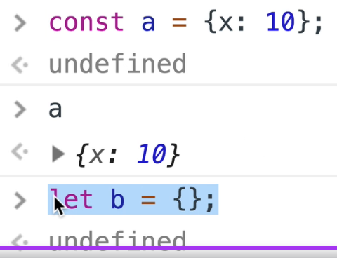

# Tipos de objetos

Relembrando:

- Quase tudo em JS é um objeto


- Objeto é uma coleção de pares *nome-valor*.

Em JS, há uma variável default chamada *Object*. Esse objeto também é uma função.

> Toda função em JS é um objeto.

**Todo** objeto é uma instância de *Object*.



☝ Por que *undefined* no console? Porque as linhas anteriores são *statements*, não são *expressões*.

## Dot Notation

Exatamente igual às propriedades no Java (se forem públicas);

## Bracket Notation

```javascript
// dot notation
variavel.propriedade = 10;

// bracket notation
variavel["propriedade"] = 10;

// com brackets, é possível usar uma variável como nome de propriedade
variavel[varNomePropriedade] = "Uma string qualquer";
```
