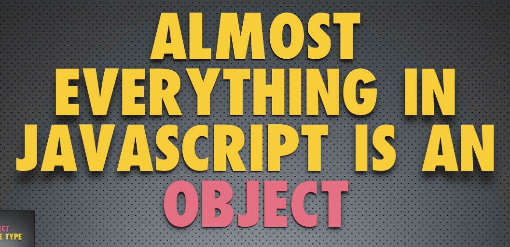

# Tipos de objetos

Relembrando:

- Quase tudo em JS é um objeto

- Objeto é uma coleção de pares *nome-valor*.

Em JS, há uma variável default chamada *Object*. Esse objeto também é uma função.

> Toda função em JS é um objeto.
