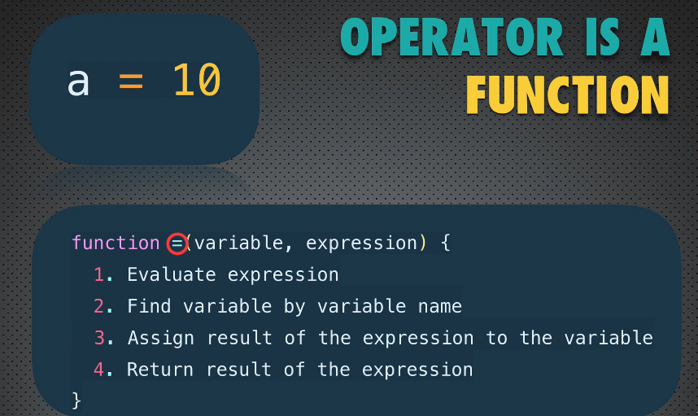

# Operadores em JS

- [Operadores em JS](#operadores-em-js)
  - [Tipos de operadores](#tipos-de-operadores)
  - [Notações com operadores](#notações-com-operadores)
    - [Infix Notation](#infix-notation)
    - [Prefix Notation](#prefix-notation)
    - [Postfix Notation](#postfix-notation)
  - [Operadores de comparação](#operadores-de-comparação)
    - [Comparando strings](#comparando-strings)
    - [Operadores de (Des)Igualdade](#operadores-de-desigualdade)
  - [Operadores lógicos](#operadores-lógicos)
    - [Novidade: operadores de atribuição](#novidade-operadores-de-atribuição)

Operadores em JS são, por baixo dos panos, simplesmente funções.
Por questões de brevidade, apontar apenas os operadores que são novidade.

Considerando que operadores são funções, o operador de atribuição seria mais ou menos assim:



## Tipos de operadores

- Unários (alguns deles)
  - `delete obj.a;`
  - `typeof a;`
  - `new Object();`
  - `a++`
- Binários
  - `===` (o único novidade)

## Notações com operadores

### Infix Notation

Usada com operadores binários

- `a = true`
- `a || b`

### Prefix Notation

Usada com operadores unários

- `++a`
- `delete obj.a`
- `typeof a`

### Postfix Notation

Usada com operadores unários

- `a++`
- `minhaFuncao()`

[Topo](#operadores-em-js)

---

## Operadores de comparação

### Comparando strings

```js
let minhaString1 = "abc";
let minhaString2 = "bcd";

console.log(minhaString1 > minhaString2);
// false -> ordem alfabética
```

```js
let minhaString1 = "abc";
let minhaString3 = "Bcd";

console.log(minhaString1 > minhaString3);
// true -> case sensitive
```


[Topo](#operadores-em-js)

### Operadores de (Des)Igualdade

Os diferentes de Java e C

| Operador | O que faz               |
| -------- | ----------------------- |
| ===      | Força igualdade de tipo |
| !==      | ☝ desigualdade de tipo  |

Preferir usar `===` e `!==` ao invés de `==` e `!=`

```js
let minhaString = "0";
let meuNumero = 0;
let meuBooleano = false;

console.log(minhaString == meuNumero);
// true

console.log(meuNumero == meuBooleano);
// true (false é "coagido" a ser número)

console.log(minhaString == meuBooleano);
// true ("0" "coagido" a ser número, false "coagido" a ser número)
```

>☝ Esquecer que esses operadores existem (Bogdan)

```js
// Forçando igualdade de tipo
console.log(minhaString === meuNumero);
// false

console.log(meuNumero === meuBooleano);
// false

console.log(minhaString === meuBooleano);
// false
```

Se eu quiser forçar conversão, usar algo assim:
```js
console.log(Number(minhaString) === meuNumero);
```
☝ preferir sempre conversão **explícita**!

[Topo](#operadores-em-js)

## Operadores lógicos

Valores Falsy:

- undefined
- null
- 0
- ""
- NaN
- false

AND `&&`, OR `||` e NOT `!`

☝ Lembrar de valores truthy e falsy

```js
// teste rápido para valores falsy
!!variável;
!!"abc";
```

### Novidade: operadores de atribuição

além dos já conhecidos:

- **=
  - potenciação
  - `x **= y`: X elevado a Y
- %=
  - `x %= y`: Resto da divisão por Y
