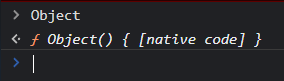

# typeof e instanceof

- [typeof e instanceof](#typeof-e-instanceof)
  - [Por que null retorna Object?](#por-que-null-retorna-object)
  - [Como tirar proveito de typeof?](#como-tirar-proveito-de-typeof)
  - [Typeof com Objetos e Arrays](#typeof-com-objetos-e-arrays)
  - [instanceof: Diferenciando Objetos de Arrays](#instanceof-diferenciando-objetos-de-arrays)
  - [Variáveis String e Boolean](#variáveis-string-e-boolean)
    - [Object, Array, String e Boolean](#object-array-string-e-boolean)
  - [Exemplo de uso de instanceof](#exemplo-de-uso-de-instanceof)


Operadores que ainda não tinham sido vistos.

```js
typeof 10; // number
typeof true; // boolean
typeof "abc"; // string
typeof undefined; // undefined
typeof null; // object
```

## Por que null retorna Object?

Estranho por "null" ser um tipo primitivo.
Relacionado com a natureza de "Object".
"Object" pode conter ponteiro para "lugar nenhum".


## Como tirar proveito de typeof?
```js
const a = 10;

if (typeof a === "number") {
	console.log("É um número!");
}
```

## Typeof com Objetos e Arrays

Ambos retornan true num `typeof` com *Object*.

```js
const meuObjeto = {
	primeiro: "teste1",
	segundo: "teste2"
};
console.log(typeof meuObjeto); // object
console.log(typeof meuObjeto.primeiro); // string

const meuArray = [true, 10, "abc"];
console.log(typeof meuArray); // object
console.log(typeof meuArray[0]); // boolean
```

Como diferenciar os dois? Com o uso de `instanceof`!

[Topo](#typeof-e-instanceof)

---

## instanceof: Diferenciando Objetos de Arrays

```js
// Diferenciando Arrays de Objetos (ainda falta null)
const c = [];
c instanceof Array; // true
c instanceof Object; // true

const d = {};
d instanceof Array; // false
d instanceof Object; // true
```

## Variáveis String e Boolean

Exemplos a seguir não são instâncias de String / Boolean

```js
const minhaString = "abc";
const meuBolleano = false;
const meuNulo = null;
const meuUndefined = undefined;

minhaString instanceof String; // false
meuBolleano instanceof Boolean; // false
meuNulo instanceof Null; // Erro de referência. Interpretou como nome de variável
meuUndefined instanceof Undefined; // Erro de referência. Interpretou como nome de variável
```

### Object, Array, String e Boolean

São:

- variáveis
- funções
- escopo global

> Toda função também é objeto!

São *Funções construtoras*: usadas para instanciar novos objetos de seu determinado tipo.



>Object concede herança a todos os outros tipos. Mesma ideia por trás do *Java*.

[Topo](#typeof-e-instanceof)

---

## Exemplo de uso de instanceof

O uso mais comum é verificar se uma variável é do tipo Array

```js
const meuArray = [1, 2];

if (meuArray instanceof Array) {
  console.log("É instância de Array!");
} else {
  console.log("NÃO é instância de Array!");
}
```
